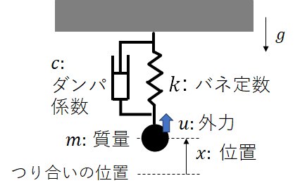

MATLAB課題

# 注意事項
本資料に従ってプログラミングをおこない，課題7個について解いてください．（応用課題については，すべての課題を終えた人だけ解いてください．基本的には課題を解いてもらえれば合格です．）
課題の解答は，PDFでレポートにまとめて提出してください．さらに，ソースコード（最終版で構いません）も提出してください．
提出場所の詳細はESAを見てください．

# MATLAB入門
MATLABとは，MathWorks社によってつくられたスクリプト言語（ソースファイルをまとめてコンパイルすることなく，１行１行順に実行していく）であり，特に行列演算を得意とする言語である．
コマンドラインに直接打ち込んで計算する方法や，`**.m`ファイルにコマンドを書き込んでそれを実行する方法がある．
基本的にはC言語等と同様の四則演算やfor構文，if構文などがサポートされ，関数やクラス等を定義して呼び出すことも可能である．
なじみがない方が多いと思うので，MATLABならではの行列の扱い方を中心に，ここでは使用法に親しんでもらう．

MATLABを起動すると，下の部分にコマンドラインが出てきます．ここにコマンドを打ちながら進めてもらっても良いですし，`.m`ファイルを作って実行しながら進めてもらっても構いません．
また，MATLABのコメントアウトは`%`コマンドです．

## 行列，ベクトルの作り方
4 つの要素を含む単一行の配列(行（横）ベクトル)を作成するには、要素をコンマ (,) またはスペースのいずれかで区切ります。
```matlab
a = [1 2 3 4];
```
これにより，横ベクトル $a=[1 2 3 4]$ が定義されます．C言語のように，配列の型やサイズをあらかじめ指定する必要はありません（自動でやってくれます）．
最後のセミコロンはつけなくても実行可能ですが，つけるとコマンドラインに実行結果が表示されなくなります．

次に，縦ベクトルは，以下のように要素をセミコロンで区切ることで定義できます．
```matlab
b = [1; 2; 3; 4];
```
あるいは，転置コマンド`.'`を使って，横ベクトルを転置して縦ベクトルにすることもできます．
```matlab
b = [1 2 3 4].';
```

行列については，同じ要領で，改行したいところでセミコロンを入れることで定義できます．
```matlab
A = [1 2 3 4; 5 6 7 8; 9 10 11 12];
```
このように書けば，$3 \times 4$ 行列 $A$ が定義できます．

覚えておくと便利な特殊な行列の作り方を紹介します．
- `A = zeros(n, m)` 全ての要素がゼロの n 行 m 列の行列を返します。
- `A = ones(n, m)` 全ての要素が１の n 行 m 列の行列を返します。
- `A = eye(n, m)` 主対角が１，それ以外がゼロの n 行 m 列の行列を返します。
実際にやってみるといいと思います．

また，この例で紹介したような　`a = [1 2 3 4]` のように数字が規則的に並んだ配列については，`a = 1:1:4` のように簡略化して表記することも可能です．
(最初の値):(刻み):(最後の値)と指定すると，その刻みで順列になった配列が定義できます．

## 四則演算


図のように重力下(重力加速度: $g$)で天井から質点（質量: $m$）が線形バネ(バネ定数: $k$)とダンパ(ダンパ定数: $c$)で釣られているシステムを考える．
この時，バネのつり合いの位置を原点として，鉛直上向き方向を正とする座標系を定義し，質点の位置を $x$と表す．バネに重りを付けなかった際（自然長時）のバネ先端の位置を $x_n = mg/k$とする．
さらに，質点には任意の外力 $u$も及ぼされるものとする（実際には接触なく外力を与えるのは難しいが，磁気等を使って外力を非接触で制御できると考えることとする）．



このとき，質点に対して時刻 $t=0$で初期位置と速度 $(x_0, \dot{x}_0)$を与えた際に，質点の運動がどのように時間発展するかを数値計算で確かめる．

## 運動方程式の導出
この質点の運動方程式は，ニュートンの運動方程式の導出方法で簡単に導出することができるが，ここではオイラーラグランジュの運動方程式を使った導出法を復習する．
まず，システムの一般化座標 $q$を定義する必要がある．ここでは，質点の位置 $x$を一般化座標 $q$として定義する．この時，ラグランジアン $L = T - V$（ $T$: 運動エネルギー, $V$: ポテンシャルエネルギー）は，以下のようにかける．
$$L = \frac{1}{2} m \dot{q}^2 - m g q - \frac{1}{2} k {(x_n - q)}^2$$
また，システムの散逸関数 $D$は，ダンパによる抵抗力を考えて以下でかける．
$$D = \frac{1}{2} c \dot{q}^2 $$
散逸関数は授業で扱われていないかもしれない．散逸関数(スカラー)は，速度のみに依存する抵抗力 $f_i$に対して， $f_i = - \frac{\partial D}{\partial \dot{q_i}}$と定義される( $i$は一般化座標 $q$の要素に対応する)．
もし，システムが，ポテンシャルや散逸関数以外に一般化力を持たなければ，全エネルギー $E$の時間発展は $\frac{dE}{dt} = - D$とかける．つまり，散逸関数の物理的意味は，単位時間あたりに抵抗力により失うエネルギーを表している．

つぎに，このシステムの一般化力 $Q$は，質点にかかる外力である $u$と表すことができる．
以上から， $q_i$に対するオイラーラグランジュ方程式
$$\frac{d}{dt} \frac{\partial L}{\partial \dot{q}_i} - \frac{\partial L}{\partial q_i} = - \frac{\partial D}{\partial \dot{q}_i} + Q_i $$
を用いることで，このシステムの運動方程式は，
$$m \ddot x + c \dot{x} + k {x} = u$$
と導出することができる．

>**Important**
>課題1 上記を実際に計算して確認せよ．導出過程も示すこと．

## 運動方程式の数値解法
多くの場合，運動シミュレーションは微分方程式（運動方程式）を数値的に解くことに帰着される．
今回の問題では， $u$が特定の関数の場合（例えば $u$が時間に依存しない場合など）には解析的に解くことができる（厳密解が導出できる）．
しかし， $u$が任意の時間関数になった場合には，解析的な解を求めるのは難しい．
ここでは，２種類の数値解法を用いて，この運動方程式（微分方程式）の時間発展を計算する．
